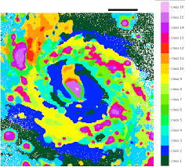
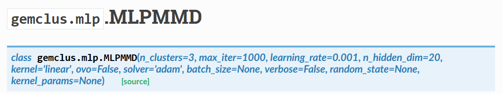
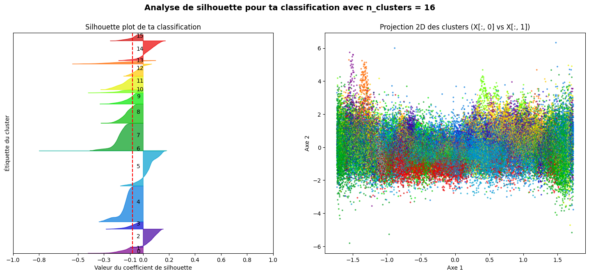
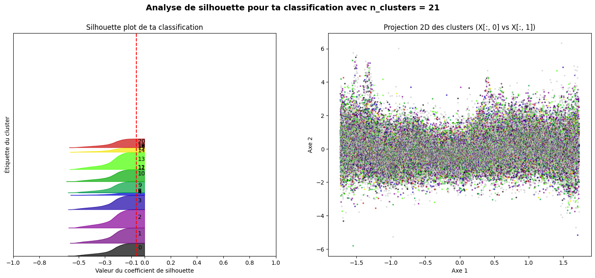
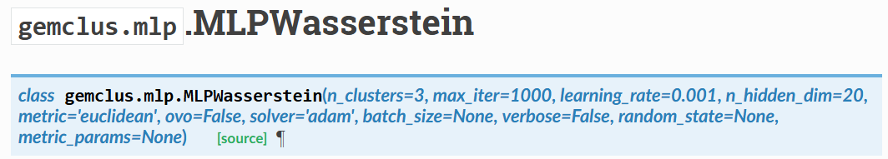

# Exploration de l’Algorithme GEMINI pour la Classification de Spectres de galaxies

Ce dépôt présente une exploration approfondie de l’algorithme **GEMINI** (Generalizable EM-based Mutual Information clustering with Neural Networks) appliqué à des données spectrales d’astronomie, en complément de l’approche classique FisherEM.  
👉 [Lien vers GEMINI - code et documentation](https://gemini-clustering.github.io/)

---

## Objectifs

- **Évaluer la performance de GEMINI** sur des données spectrales connues (galaxie NGC 1068)
  

- **Comparer les résultats** obtenus avec ceux issus de FisherEM, publiés par Chambon & Fraix-Burnet, 2023. 
- Analyser l’apport des distances de noyau (MMD, Wasserstein) par rapport aux méthodes traditionnelles basées sur les moyennes et distances euclidiennes

---

## Contexte et motivation

Parallèlement à l'utilisation de FisherEM, nous avons souhaité explorer des méthodes de clustering fondées sur le deep learning, notamment **GEMINI**. Contrairement à K-means ou FisherEM qui reposent sur des moyennes et des distances euclidiennes, GEMINI exploite des **distances de noyau** telles que **MMD** (Maximum Mean Discrepancy) ou **Wasserstein**, qui mesurent la similarité globale entre des distributions (spectres).

Nous avons appliqué GEMINI sur les données **NGC 1068** déjà bien connues, afin de comparer objectivement ses performances et comportements à ceux de FisherEM, qui avaient fait l’objet d’une publication l’année précédente [Chambon et Al.].

---

## Hyperparamètres clés de GEMINI

- `hidden dim` : contrôle la complexité de l’espace latent où les spectres sont projetés
- `learning rate` : règle la vitesse d’apprentissage du modèle
- `OvO (One-vs-One)` : chaque paire de classes est distinguée individuellement par le modèle
- `OvA (One-vs-All)` : chaque classe est distinguée de toutes les autres combinées
- `Kernel` : fonction de pondération permettant d'estimer la distance entre distributions

---

## Résultats et analyse 

- Après optimisation des hyperparamètres, nous avons pu comparer la **qualité du clustering** de GEMINI à celle de FisherEM, notamment via le **silhouette score par classe**, les graphes sont dans la section `figures/`.
- **GEMINI** a tendance à créer des groupes assez **uniformes** (clusters “sphériques”), similaires à ceux de **k-means**, ce qui peut limiter la détection de structures plus complexes, comme on peut l'apercevoir ci dessous avec les silhouette score des classes.

  
  

  <em>À gauche : FisherEM — À droite : GEMINI</em>

- **FisherEM** permet d’identifier des clusters aux formes variées, souvent mieux adaptés à la diversité réelle des spectres galactiques.
- **L’introduction de la distance Wasserstein** dans GEMINI permet de dépasser la limitation des formes sphériques : elle prend en compte la forme globale des distributions, et facilite l’identification de groupes complexes ou “allongés”.
> **À noter :** Ce travail sera poursuivi par M.Hugo Chambon.

---

## Pour aller plus loin

- **Scripts de lancements GEMINI** : voir le dossier `py/` ou [les tutoriels sur le dépôt GitHub principal de GEMINI](https://gemini-clustering.github.io/auto_examples/index.html)
- **Analyse et visualisation des résultats** : ce dépôt contient un notebook dédié (`py/plot_compare_gemclus_results.ipynb`) à la comparaison des clusters, et la visualisation avancée (diagrammes de Sankey, scores ..etc)
- **Résultats des classifications** :
    - voir le dossier `CSV/` qui contient les résultats des classifications les plus concluentes **(aux silhouette score élevé)**
    - voir le dossier `json/` qui contient des *.json(l)* avec les détails de toutes les classifications **(temps d'exécution, nombre de classes demandées et trouvées, les scores, les valeurs de tout les hyperparamétres)**
> ces `.json(l)` permettre de sauvegarder en continues les classifications, et par conséquent analyser et visualiser les résultats

---

## Références

- [Article FisherEM (Chambon & Fraix-Burnet, 2023)](https://www.aanda.org/articles/aa/pdf/2024/08/aa49516-24.pdf)
- [Code source GEMINI](https://gemini-clustering.github.io/)

---

> Ce travail a été réalisé dans le cadre d’un stage d’excellence en recherche, en collaboration avec l’IPAG (Université Grenoble Alpes).
